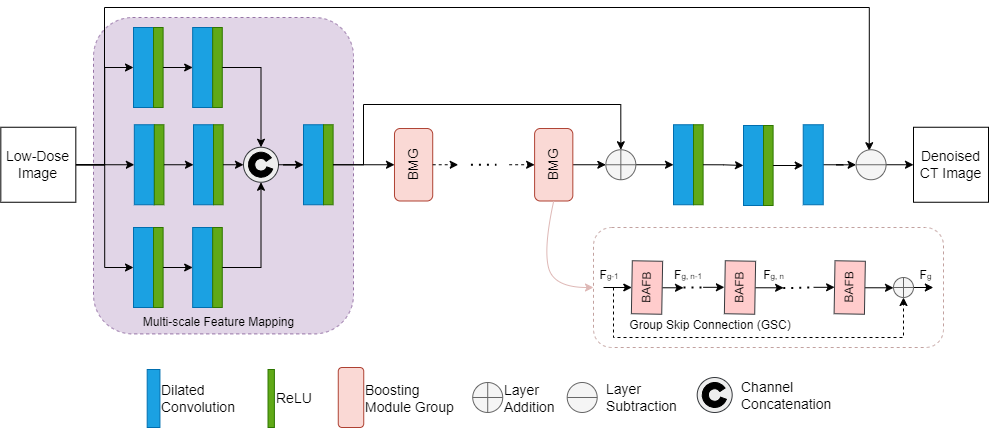
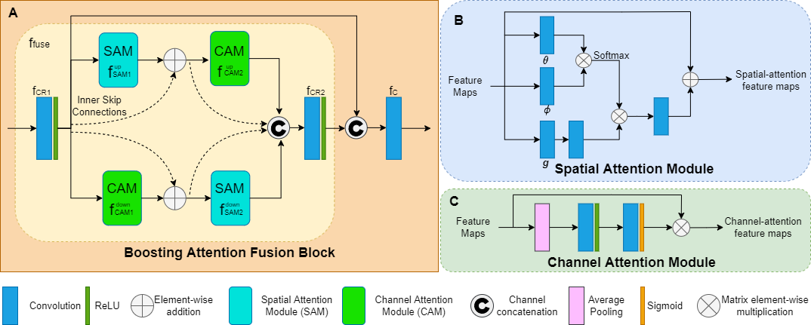
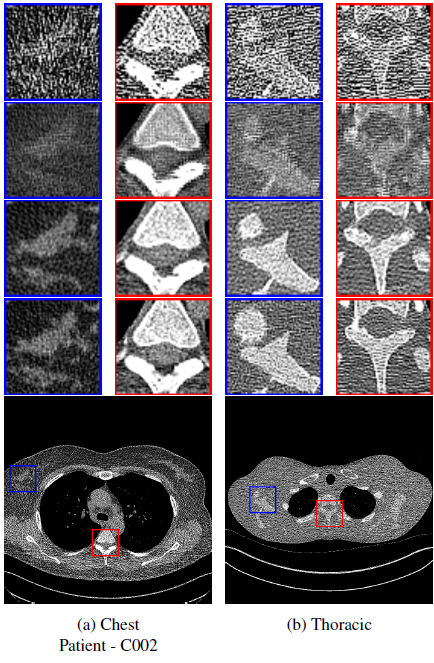

# MD-RFA
A Multi-scale Dilation with Residual Fused Attention Network for Low-Dose CT Noise Artifact Reductions.

## Table of Contents
* [Introduction](https://github.com/kevinmfreire/MD-RFA-NET#introduction)
* [Methods](https://github.com/kevinmfreire/MD-RFA-NET#methods)
* [Results](https://github.com/kevinmfreire/MD-RFA-NET#results)
* [References](https://github.com/kevinmfreire/MD-RFA-NET#references)
* [Web Application](https://github.com/kevinmfreire/MD-RFA-NET#website)

## Introduction
Computed Tomography (CT) Scans have produced more than half the radiation exposure from medical use which results in problems for long term use of these expensive machines.  Some solutions have involved reducing the radiation dose, however that leads to noise artifacts making the low-dose CT (LDCT) images unreliable for diagnosis.  In this study, a Multi-scale Dilation with Residual Fused Attention (MD-RFA) deep neural network is proposed, more specifically a network with an integration with a multi-scale feature mapping, spatial- and channel-attention module to enhance the quality of LDCT images.  Further, the multi-scale image mapping uses a series of dilated convolution layers, which promotes the model to capture hierarchy features of different scales.  The attention modules are combined in a parallel connection and are described as a Boosting Attention Fusion Block (BAFB) that are then stacked on top of one another creating a residual connection known as a Boosting Module Group (BMG).

## Methods
The MD-RFA network is introduced containing the Multi-scale feature map, the fused attention modules for the fusion of the channel- and spatial-wise features of the images.

### Proposed model
Shown in **Figure 1**, the proposed denoising network is constructed with a series of dilated convolution layers that utilizes different dilation rate to capture the hierarchy features of different scales. The next section of the network is the multi-dimensional deep features in the cascade BMG. In each BMG, a stack of **N** BAFB contain the fusion of the spatial and channel attention modules shown in **Figure 2**. The last section of the network architecture uses additional convolution + ReLU for the reconstruction layers as presented in **Figure 1**. Two skip connections are used, the outer for noise removal and the inner to prevent the vanishing gradient.

### Multi-scale Feature Mapping
A series of dilated convolution layers are used for learning multi-scale noise artefact features. With the same filter size (3x3), the dilated convolution can capture more region of interest (ROI) without introducing additional parameters. In this work, the convolution layers with different scale dilation are concatenated and placed at the beginning of the proposed network as illustrated in **Figure 1**. For extracting the multi-scale feature mappings of the LDCT images, it uses three different dilation factors (f = 1, 2, 4, where f is the dilation factor), with two stacked convolution layers of size 3x3 and 32 number of filters.

 
<figure>
    
    <figcaption>Figure 1: The Multi-scale Dilation with Residual Fused Attention (MD-RFA) Model Architecture.</figcaption>
</figure> 
 

### Attention Modules
Inside BAFB from **Figure 2A**, the integration of spatial and channel- attention modules are implemented as shown in **Figure 2C**. This is due to the fact that simple Conv + BN + ReLU operation cannot capture the high and low frequency information of the feature map present during the pre-convolutional process. SAM, **Figure 2B**, is responsible for the long-range dependencies. Through experimentation, it was found that increasing the kernel size of **g** to 3x3 improves model performance. CAM, **Figure 2C**, is responsible for capturing the channel-wise features. These operations tend to bypass one another and therefore, fusion between the two should be applied as shown in **Figure 2A**.

 
<figure>
    
    <figcaption>Figure 2: The Boosting Module Group composed of (A) Boosting Attention Fusion Block (BAFB), (B) Spatial Attention Module (SAM) and (C) Channel Attention Module (CAM).</figcaption>
</figure> 
 

## Results
I performaed a visual comparison between the proposed MD-RFA model and the Fused Attention Module with Dilated Residual Learning (FAM-DRL). **Figure 3** displays a noticeable difference between the two models. In regards to the red bounding box (ROI) from **Figure 3** the overall contrast and structure of the reconstructed image, with the FAM-DRL producing a darker image with minor smoothed edges and the MD-RFA retaining similar results to the NDCT image. In the blue sample, the FAM-DRL has a smoothing affect and fails to display the information within the ROI.

 
<figure>

    
    <figcaption>Figure 3: Sample visual results of highlighted sections (red/blue ROI bounding box) from the Chest and Thoracic dataset. From Top to bottom of ROI samples, LDCT, FAM-DRL, MDRFA, NDCT images.</figcaption>

</figure> 
 

## References 
* [FAM-DRL](https://ieeexplore.ieee.org/abstract/document/9630790)

## Website
You can preview how the model works by visiting my streamlit web application [here](https://kevinmfreire-md-rfa-app-yc18hv.streamlit.app/).